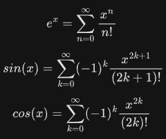

# Задача 3
Напишите функции-генераторы, которые выводят элементы разложения sin, cos и exp в ряды Тейлора. После, используя функциональный подход, найдите сумму членов ряда и сравните её со значением вычисления функции из модуля math. Выведите разницу в экспоненциальном представлении.

Разложение функций в ряд Тейлора:

‌   

Входные данные

Введите значение угла в радианах: 1

Введите количество элементов ряда: 5

Вывод программы

math.sin(x) − sin(x) = -2.5e-8
math.cos(x) − cos(x) = -2.7e-7
math.exp(x) − exp(x) = 9.9e-3
Рекомендации
Запишите k-ый и (k-1)-ый члены разложения. Найдите множитель, на который они отличаются, чтобы использовать его в функции-генераторе.

Для вывода числа в экспоненциальной форме вспомните тему «Форматирование строк».