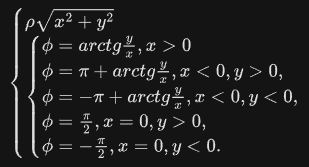

# Задача 4
Реализуйте преобразование координат точки на плоскости из декартовой системы координат в полярную. Точка в декартовой системе координат задаётся двумя вещественными числами x и y, которые означают величины проекций точки на оси.

Координаты в полярной системе координат:

полярный радиус — расстояние от начала системы координат;

полярный угол — угол, отсчитываемый против часовой стрелки от луча, выходящего из начала системы координат.

Преобразование из декартовых координат в полярные выглядит следующим образом:

‌   

При таком преобразовании полярный угол будет находиться в промежутке ‌[-pi,pi]

Входные данные

Введите декартовы координаты в виде x;y: 10;-33

Вывод программы

Полярный радиус: radius=34.482
Полярный угол: phi=-1.277